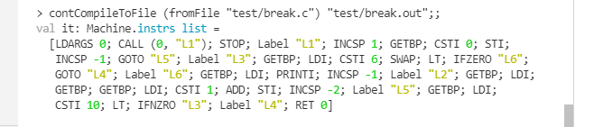
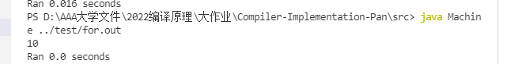
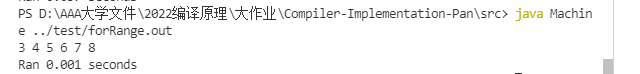
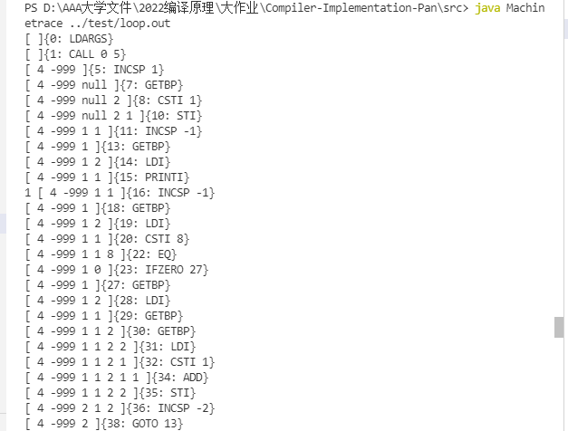

2021-2022学年第2学期

# 实验报告


- 课程名称: <u>编程语言原理与编译</u>

- 实验项目: <u>期末大作业</u>

- 专业班级: <u>计算1902</u>

- 学生学号: <u>31901048</u>

- 学生姓名: <u>潘禹均</u>

- 实验指导教师: <u>张芸</u>

  

## 1.项目简介

?	编译原理课程是计算机相关专业学生的[必修课程](https://baike.baidu.com/item/%E5%BF%85%E4%BF%AE%E8%AF%BE%E7%A8%8B/1257453)和高等学校培养计算机专业人才的基础及核心课程，同时也是计算机专业课程中最难及最挑战学习能力的课程之一。 它旨在介绍[编译程序](https://baike.baidu.com/item/%E7%BC%96%E8%AF%91%E7%A8%8B%E5%BA%8F/8290180)构造的一般原理和基本方法。内容包括语言和文法、[词法分析](https://baike.baidu.com/item/%E8%AF%8D%E6%B3%95%E5%88%86%E6%9E%90/8853461)、语法分析、[语法制导翻译](https://baike.baidu.com/item/%E8%AF%AD%E6%B3%95%E5%88%B6%E5%AF%BC%E7%BF%BB%E8%AF%91/2665709)、中间代码生成、[存储管理](https://baike.baidu.com/item/%E5%AD%98%E5%82%A8%E7%AE%A1%E7%90%86/9827115)、代码优化和目标代码生成。 

?	本次编译原理大作业，我是基于老师在期末大作业文件夹里面给的microc并参考一些其他的资料来完成的。

?	本次作业由于是一个人完成的，并且时间紧任务重。因此相比较于两人队伍，可能实现的功能比较少一些。还有一些功能的实现也不太理想，或者有想法却无法实现。编译原理还有很多需要我继续学习的地方。


## 2.文件说明

### interpreter  解释器

```
AbstractSyn.fs         	 抽象语法
lex.fsl				     fslex词法定义
par.fsy					 fsyacc语法定义
Parse.fs				 语法解析器
Interp.fs				 解释器
test/ex1.c-ex12.c 		 例子程序
interpc.fsproj			 项目文件
```


## 3.用法

### 前端

#### 优化编译器

- 写完AbstractSyn.fs

- Par.fsy引入AbstractSyn，通过Par.fsy生成Par.fs语法分析器

  ```sh
  dotnet "C:\Users\Administrator\.nuget\packages\fslexyacc\10.2.0\build\/fsyacc/netcoreapp3.1\fsyacc.dll"  -o "Par.fs" --module Par Par.fsy
  ```

  

  

- Lex.fsl 代码中打开 Par，通过Lex.fsl生成Lex.fs词法分析器

  ```sh
  dotnet "C:\Users\Administrator\.nuget\packages\fslexyacc\10.2.0\build\/fslex/netcoreapp3.1\fslex.dll"  -o "Lex.fs" --module Lex --unicode Lex.fsl
  ```

  

  

- 命令行运行程序，引入引用包

  ```sh
  dotnet fsi
  #r "nuget: FsLexYacc";;  //添加包引用
  ```

- 加载运行该编译器

  ```sh
  #load "AbstractSyn.fs" "Par.fs" "Lex.fs" "Debug.fs" "Parse.fs" "machine.fs" "Contcomp.fs" "ParseAndcontComp.fs" ;;
  ```

- open parseAndComp，之后可在fsi中进行编译 *.c文件,生成中间表示 *.out

  ```sh
  open ParseAndContcomp;;
  contCompileToFile (fromFile "test/switch.c") "test/switch.out";;  
  ```

- 生成中间表示

  ```sh
  24 19 0 5 25 15 1 15 1 13 0 0 12 15 -1 13 0 1 1 0 1 12 15 -1 13 0 1 1 11 0 1 6 17 60 13 13 0 1 1 11 13 0 1 1 11 1 12 15 -1 13 13 11 0 5 1 12 15 -1 16 70 13 0 1 1 11 0 3 6 17 81 13 13 11 0 1 1 12 15 -1 16 109 13 0 1 1 11 0 5 6 17 109 13 13 11 13 0 1 1 11 13 0 1 1 11 3 1 12 15 -1 13 11 22 21 2
  ```

  

- 优化编译器的另外构建方式

  ```sh
  # 构建 microc.exe 编译器程序 
  dotnet restore  microcc.fsproj # 可选
  dotnet clean  microcc.fsproj   # 可选
  dotnet build  microcc.fsproj   # 构建 ./bin/Debug/net6.0/microc.exe
  
  dotnet run --project microcc.fsproj example/ex1.c    # 执行编译器，编译 ex1.c，并输出  ex1.out 文件
  dotnet run --project microcc.fsproj -g test/switch.c   # -g 查看调试信息
  ./bin/Debug/net5.0/microcc.exe test/switch.c  # 直接执行构建的.exe文件，同上效果
  ```

  

#### 解释器

- 生成扫描器（同上）

  ```sh
  dotnet "C:\Users\Administrator\.nuget\packages\fslexyacc\10.2.0\build\/fslex/netcoreapp3.1\fslex.dll"  -o "Lex.fs" --module Lex --unicode Lex.fsl
  ```

- 生成分析器(同上)

  ```sh
  dotnet "C:\Users\gm\.nuget\packages\fslexyacc\10.2.0\build\/fsyacc/netcoreapp3.1\fsyacc.dll"  -o "Par.fs" --module Par Par.fsy
  ```

- 命令行运行程序，引入引用包

  ```sh
  # 命令行运行程序
  dotnet fsi 
  #r "nuget: FsLexYacc";;  //添加包引用
  ```

- 载入程序

  ```sh
  #load "AbstractSyn.fs" "Debug.fs" "Par.fs" "Lex.fs" "Parse.fs" "interp.fs" "ParseAndRun.fs" ;; 
  ```

- 导入模块并运行

  ```sh
  open ParseAndRun;;    //导入模块 ParseAndRun
  fromFile "test/switch.c";;    //显示 ex1.c的语法树
  run (fromFile "test/switch.c") [];; //解释执行 switch.c
  ```

  


### 后端

- javac编译后端虚拟机 *.java 文件

  ```sh
  javac Machine.java  //生成虚拟机
  ```

- 在虚拟机中运行编译生成的.out文件

  ```sh
  java Machine switch.out
  ```

- java Machinetrace 追踪堆栈变化

  ```sh
  java Machinetrace switch.out
  ```


## 4.功能实现

### switch-case功能

- 说明：Switch在一些计算机语言中是保留字，其作用大多情况下是进行[判断](https://baike.baidu.com/item/%E5%88%A4%E6%96%AD/33345)选择。以[C语言](https://baike.baidu.com/item/C%E8%AF%AD%E8%A8%80/105958)来说，switch（开关语句）常和case break default一起使用。 当变量表达式所表达的量与其中一个case语句中的常量相符时，就执行此case语句后面的语句，并依次下去执行后面所有case语句中的语句，除非遇到break;语句跳出switch语句为止。如果变量表达式的量与所有case语句的常量都不相符，就执行default语句中的语句。 

- 测试用例

  ```c
  int main(){
      int i;
      int n;
      i=0;
      n=1;
      switch(n){
          case 1:{i=n+n;i=i+5;}
          case 2:{i=i*2;}
          case 3:{i=i+1;break;}
          case 5:i=i+n*n;
      }
      print i;
  }
  ```

- 语法树（部分截图）

  

  

- 编译为指令集

  

  

- 运行结果

  

- 运行栈追踪

  

  

### break功能

- 说明：在一个循环中，往往需要break功能来退出循环，否则会一直持续下去，因此将break应用于循环中。

- 测试用例

  ```c
  int main()
  {
      int i;
      for(i = 0; i < 100; i++) {
          if (i > 6)
              break;
          print i;
      }
  }
  ```

- 语法树

  

  

- 前端编译为指令集

  

  

  

  

- 运行结果

  

  

- 运行栈追踪


### char类型

- 说明：原来的microc没有char类型，于是我添加了这一个类型，方便对字符的进一步操作。

- 测试用例

  ```c
  int main(){
      char i;
      i='a';
      print i;
  }
  ```

- 语法树

  

  

- 前端编译为指令集

  

  

  

  

  

- 运行结果

  

- 运行栈追踪


### 三目运算功能

- 说明：三目运算符，又称条件运算符，是计算机语言（c,c++,java等）的重要组成部分。它是唯一有3个操作数的运算符，有时又称为[三元](https://baike.baidu.com/item/%E4%B8%89%E5%85%83/34063)运算符。 

  a ? b : c简单理解方式为:

  ```c
  if(a) {
      return b;
  } else {
      return c;
  }
  ```

- 测试用例：

  ```c
  int main()
  {
      int c = 10;
      int b = 8;
      int a = c>b ? c:b;
      print a;
  }
  ```

- 语法树

  

  

- 前端编译为指令集

  

  ?	

  

- 运行结果

  

  

- 运行栈追踪

  

  

### continue功能

- 说明：计算机术语，表示结束本次循环，进行下一次循环，而不终止整个循环的执行。 

- 测试用例

  ```c
  int main()
  {
      int i;
      for(i = 0; i < 13; i++) {
          if(i % 2 == 1)
              continue;
          print i;
      }
  }
  ```

- 语法树

  

  

- 编译为指令集

  

  

  

- 运行结果

  

  

- 运行栈追踪


### default功能

- 说明：在switch-case的功能中，若所有的case都没有符合我们输入的那种情况，此时加入default，那么default对应的语句都能执行。在程序中使用该关键字提供一个默认的方法。 

- 测试用例

  ```c
  int main()
  {
      int i = 0;
      int n = 10;
      switch(n) {
          case 0: print i+0;
          case 1: print i+1;
          case 2: print i+2;
          default: print n*n;
               
      }
  }
  ```

- 语法树

  

  

- 编译成指令集

  

  

  

  

- 运行结果

  

  

- 运行栈追踪

  


### 定义变量时赋值功能

- 说明：在原来的microc中，需要先将一个变量定义为一种类型之后，才能将该变量赋值，而添加了该功能后，可以做到在定义变量时候就赋值。

- 测试用例

  ```c
  int main()
  {
      int a = 1;
      int b = 3.14;
      int c = 'p';
      print a;
      print b;
      print c;
  }
  ```

- 语法树

  

  

- 编译为指令集

  

  

  

  

- 运行结果

  

  

- 运行栈追踪

  


### do...While...功能

- 说明：do...while 循环是?[while](https://baike.baidu.com/item/while/755564)?循环的变体。在检查while()条件是否为真之前，该[循环](https://baike.baidu.com/item/%E5%BE%AA%E7%8E%AF/71073)首先会执行一次do{}之内的[语句](https://baike.baidu.com/item/%E8%AF%AD%E5%8F%A5/9624168)，然后在while()内检查条件是否为真，如果条件为真的话，就会重复do...while这个循环,直至while()为假。 

- 测试用例

  ```c
  int main(){
      int n;
      n = 1;
      int a;
      a = 0;
      do{
          a = a + n;
          n = n + 1;
      }while(n<=5);
      print a;
      print n;
  }
  ```

  

- 语法树

  

  

- 编译为指令集

  

  ?	

  

  

- 运行结果

  

  

- 运行栈追踪

  


### Float类型

- 说明：相比较于int类型，float的类型有了小数，可以使得计算更精确。

- 测试用例：

  ```c
  int main()
  {
      float a;
      a = 1.1;
      int b;
      b = 2;
      print a+b;
  }
  ```

- 语法树

  

  

- 编译为指令集

  

?	


- 运行结果

  

- 运行栈追踪

  


### For循环功能

- 说明：for循环是编程语言中一种循环语句，而[循环语句](https://baike.baidu.com/item/%E5%BE%AA%E7%8E%AF%E8%AF%AD%E5%8F%A5/4410586)由[循环体](https://baike.baidu.com/item/%E5%BE%AA%E7%8E%AF%E4%BD%93/5125491)及循环的判定[条件](https://baike.baidu.com/item/%E6%9D%A1%E4%BB%B6/1783021)两部分组成，其表达式为：for（单次表达式;条件表达式;末尾循环体）{中间循环体；}。 

- 测试用例

  ```C
  int main()
  {
      int i;
      i = 0;
      int n;
      n = 0;
      for(i =0 ; i < 5 ;  i=i+1){
          n = n + i;
      }
      print n;
  }
  ```

  

- 语法树

  

  

- 编译为指令集

  

  ?	

- 运行结果

  

  

- 运行栈追踪

  

  

### For Range功能

- 说明：在指定的范围内

- 测试用例

  ```c
  int main()
  {
      int i;
      for i in (3..9) {
          print i;
      }
  }
  ```

  

- 语法树

  

  

- 编译成指令集

  

  

  

  

- 运行结果

  

- 运行栈追踪

  


### loop循环

- 说明：与c语言的while类似，可以一直无限循环。需要添加break，return来实现退出循环。可以代替for循环，do...while循环，while循环等。

- 测试用例：

  ```c
  int main()
  {
      int i;
      i = 1;
      loop {
          print i;
          if(i == 8)
              break;
          i++;
      }
  }
  ```

- 语法树

  

  

- 编译为指令集

  

  

  

  

- 运行结果

  

  

- 运行栈追踪

  


### 自增自减功能

- 说明：实现了自增自减功能。自增自减运算符存在于[C](https://baike.baidu.com/item/C/7252092)/[C++](https://baike.baidu.com/item/C%2B%2B/99272)/[C#](https://baike.baidu.com/item/C%23/195147)/[Java](https://baike.baidu.com/item/Java/85979)/等[高级语言](https://baike.baidu.com/item/%E9%AB%98%E7%BA%A7%E8%AF%AD%E8%A8%80/299113)中，它的作用是在运算结束前（前置自增自减运算符）或后（后置自增自减运算符）将[变量](https://baike.baidu.com/item/%E5%8F%98%E9%87%8F/3956968)的值加（或减）一。

- 测试用例

  ```c
  int main()
  {
    int a;
    int b;
    a=1;
    b=1;
    print a;
    a++;
    print a;
    ++a;
    print a;
    b--;
    print b;
    --b;
    print b;
  }
  ```

  

- 语法树

  

  

-  编译为指令集

  

  

- 运行结果

  

  

- 运行栈追踪

  


## 5.项目技术自评

| 功能            | 对应文件    | 优   | 良   | 中   |
| --------------- | ----------- | ---- | ---- | ---- |
| switch-case功能 | switch.c    | √    |      |      |
| break功能       | break.c     | √    |      |      |
| char类型        | char.c      |      | √    |      |
| 三目运算功能    | condition.c | √    |      |      |
| continue功能    | continue.c  |      | √    |      |
| default功能     | default.c   |      | √    |      |
| 定义变量赋值    | define.c    |      | √    |      |
| do..while功能   | doWhile.c   | √    |      |      |
| Float类型       | float.c     | √    |      |      |
| For循环         | for.c       | √    |      |      |
| For in Range    | forRange.c  | √    |      |      |
| Loop循环        | loop.c      |      | √    |      |
| 自增自减功能    | selfPlus.c  | √    |      |      |

## 6.项目成员

| 姓名   | 班级     | 学号     | 任务 | 权重 |
| ------ | -------- | -------- | ---- | ---- |
| 潘禹均 | 计算1902 | 31901048 | 全部 | 1.0  |

## 7.提交日志


## 8.心得体会

?	编译原理作为我们大三的最后一门必修课，压轴的课程果然是最难的。但是作为一名计算机科学与技术专业的学生，这是一门不可能不上的课程。说实话，平时上课的时候对这门课程的理解也不是很通透，以至于写作业的时候会有点云里雾里的感觉。虽然说老师上课会有演示，或者讲解例子，但是到自己去做的时候，发现看懂了并不代表真的懂了。抽象语法树，词法，语法分析这些概念很难理解，同时初见F#时，对这一语言很陌生，网络上资料又很少，遇到了问题都不好去寻找解决方式。

?	因为这学期我比其他同学还多了两门数字治理创新班的课程，这也就让我有更多的大作业和期末考，同时我也是一个人组队去做这个大作业，相对来说，时间比较紧迫。一开始，我也不知从何下手，只能说是按照老师给的microc，以及往届学长们做的Cuby，来对照着看他们是如何在microc的基础上进行修改的，按照他们的思路来走一遍。于是我也模仿着他们，在microc的基础上对自己的大作业进行修改。渐渐地，我对这个程序的结构有了一定的认识。CLex和CPar都有自己的作用，我在自己的大作业中将他们命名为了Lex和Par。Lex和Par通过AbstractSyn来生成抽象语法树，通过Contcomp.fs对其进行编译。然后后端用java文件，输出其结果和栈追踪。

?	虽说这次大作业的编写过程可以说是十分痛苦的，从一开始的毫无头绪到后来渐渐有了自己的想法，语法这些什么的都要对照着以前的作品看，自己慢慢琢磨。但是，我觉得这个大作业相当于是在microc的基础上，自主添加自己想加的内容，来制作出一个独特的语言。

?	当然，从这门课中，我也有不少的收获。学习了编译原理，让我重新认识了函数式编程的语言特点与特性，开拓了我的眼界，让我知道原来除了我们所学的熟悉的c语言，java，python等，还有F#这些比较小众些的语言。同时，虽说编译原理很难，但是学习了之后肯定会比原来对于原理有了更加深入的理解。编译原理是一门需要我们去慢慢体会的课程，初见时让人一头雾水，但是当渐渐地去深入的了解之后，也会发现它的乐趣所在。对我来说，在计算机学习的这条路上，还有很多是要继续学习的。

?	

?	


