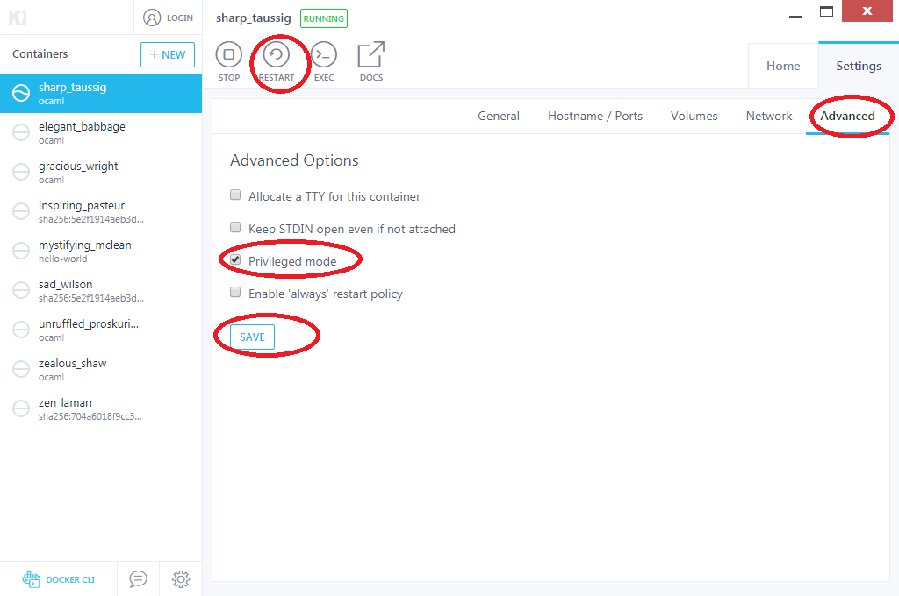

### Docker 容器配置

设置以Privileged 特权模式启动容器，opam 需要权限



Setting ==> Advanced ==> Privileged ==> Save ==> Restart


### 安装 llvm cmake并确定llvm版本 

```sh
apt-get update
apt install llvm cmake
lli -version
```

### 安装opam 

```sh
apt install opam
opam init   #下载 花时间
opam switch system
eval `opam config env`
```

### opam 安装 ocaml llvm 包

```sh
opam install llvm.6.0.0
```

### 保留当前容器

```sh
docker ps
docker commit <id> sigcc/opam:v1  # <id> : container id
docker images
```
如下所示：

```powershell
$ docker ps
CONTAINER ID        IMAGE               COMMAND                CREATED
   STATUS              PORTS                              NAMES
16dedbcc0be2        sigcc/ocaml         "/tini -- ttyd bash"   52 seconds ago
   Up 52 seconds       0.0.0.0:7680-7681->7680-7681/tcp   sharp_taussig

$ docker commit 16dedbcc0be2 sigcc/opam:v1
sha256:294cbaad7e2b9c47aa9ba859cf54818206bf7ce891495d22349021c176814313

$ docker images
REPOSITORY          TAG                 IMAGE ID            CREATED
SIZE
sigcc/opam          v1                  294cbaad7e2b        8 seconds ago
1.75GB
sigcc/ocaml         latest              09680c837260        7 weeks ago
1.67GB
```
### 编译 microc llvm项目

in Docker
rz 选择文件

```sh
root@f19995ee707b:~/workspace# ll
total 60
drwxr-xr-x 1 root root  4096 Sep  4 15:10 ./
drwx------ 1 root root  4096 Oct 30 09:08 ../
-rwxr-xr-x 1 root root 45893 Sep  4 14:45 lecture.ml*
root@f19995ee707b:~/workspace# rz 
root@f19995ee707b:~/workspace# ll
total 76
drwxr-xr-x 1 root root  4096 Oct 30 09:22 ./
drwx------ 1 root root  4096 Oct 30 09:08 ../
-rwxr-xr-x 1 root root 45893 Sep  4 14:45 lecture.ml*
-rw------- 1 root root 16292 Nov 27  2016 microc-llvm.tar.gz
```
```sh
tar xvf microc-llvm.tar.gz

root@f19995ee707b:~/workspace/microc-llvm# make
ocamlbuild -use-ocamlfind -pkgs llvm,llvm.analysis -cflags -w,+a-4 \
        microc.native
Finished, 22 targets (0 cached) in 00:00:01.
root@f19995ee707b:~/workspace/microc-llvm# ll
total 64
drwxr-xr-x 4 root root 4096 Oct 30 09:23 ./
drwxr-xr-x 1 root root 4096 Oct 30 09:23 ../
-rw-rw-r-- 1 1000 1000 2212 Feb 22  2016 Makefile
-rw-rw-r-- 1 1000 1000 5421 Feb 22  2016 README
drwxr-xr-x 2 root root 4096 Oct 30 09:23 _build/
-rw-rw-r-- 1 1000 1000 2753 Feb 17  2016 ast.ml
-rw-rw-r-- 1 1000 1000 6920 Feb 21  2016 codegen.ml
-rw-rw-r-- 1 1000 1000  829 Feb 17  2016 microc.ml
lrwxrwxrwx 1 root root   48 Oct 30 09:23 microc.native -> /root/workspace/microc-llvm/_build/microc.native*

root@f19995ee707b:~/workspace/microc-llvm# ./testall.sh 
test-add1...OK
test-arith1...OK
test-arith2...OK
test-arith3...OK
test-fib...OK
test-for1...OK
....

?```sh

root@f19995ee707b:~/workspace/microc-llvm# cat tests/test-hello.mc
int main()
{
  print(42);
  print(71);
  print(1);
  return 0;
}

root@f19995ee707b:~/workspace/microc-llvm# ./microc.native < tests/test-hello.mc
; ModuleID = 'MicroC'
source_filename = "MicroC"

@fmt = private unnamed_addr constant [4 x i8] c"%d\0A\00"

declare i32 @printf(i8*, ...)

define i32 @main() {
entry:
  %printf = call i32 (i8*, ...) @printf(i8* getelementptr inbounds ([4 x i8], [4 x i8]* @fmt, i32 0, i32 0), i32 42)
  %printf1 = call i32 (i8*, ...) @printf(i8* getelementptr inbounds ([4 x i8], [4 x i8]* @fmt, i32 0, i32 0), i32 71)
  %printf2 = call i32 (i8*, ...) @printf(i8* getelementptr inbounds ([4 x i8], [4 x i8]* @fmt, i32 0, i32 0), i32 1)
  ret i32 0
}
root@f19995ee707b:~/workspace/microc-llvm# lli hello.ll 
42
71
1
```
